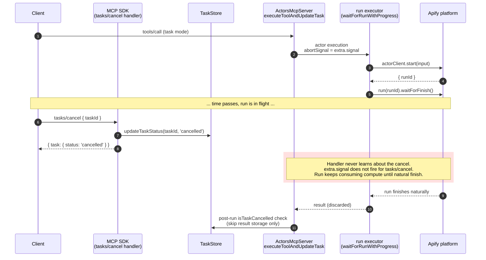
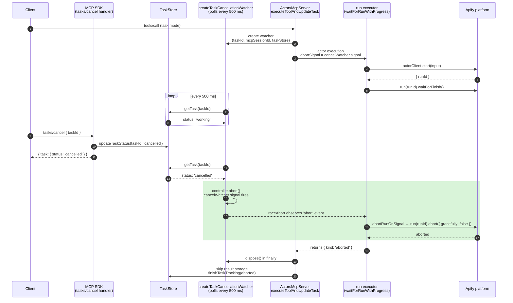
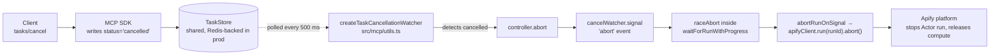

# `tasks/cancel` → Actor abort flow

How a client's `tasks/cancel` request gets translated into an actual
`apifyClient.run(runId).abort()` call against the Apify platform, and what
PR #812 (issue #763) changed.

Anchors use symbol names; verify line numbers against current source before trusting them.

## The bug

The MCP SDK's `tasks/cancel` request handler (`CancelTaskRequestSchema`) does only this:

1. Reads the task from the `TaskStore`.
2. Verifies it is not in a terminal status.
3. Writes `status='cancelled'` to the `TaskStore`.
4. Clears the task's pending message queue.
5. Returns the cancelled task.

It does **not** abort the in-flight request's `AbortController`. This differs from the older
`notifications/cancelled` notification (handled by the SDK's `_oncancel`), which **does**
call `controller.abort()`.

Net effect before PR #812: a client could call `tasks/cancel`, the task would flip to
`cancelled`, but the tool handler kept running and the underlying Apify run kept consuming
compute until natural completion — "I cancelled, but my Apify bill kept ticking."

## Where the actor is actually aborted

In `src/tools/core/actor_run_response.ts`, `abortRunOnSignal(runId, client)` calls:

```ts
await client.run(runId).abort({ gracefully: false });
```

This is the default `onAbort` callback. `waitForRunWithProgress` races each platform call
(`run.get()`, `run.waitForFinish()`) against the request's `AbortSignal` via `raceAbort`;
when the signal wins, it invokes `onAbort` before returning `{ kind: 'aborted' }`. The abort
plumbing existed before PR #812 — what #812 fixed is making the right `AbortSignal` reach it
for `tasks/cancel`.

## Before PR #812



The post-run `isTaskCancelled` check (`src/mcp/server.ts`, see `isTaskCancelled`) mitigated
the *result-storage* half (we don't return data for a cancelled task) but did nothing about
the *compute-consumption* half.

## After PR #812



`cancelWatcher.signal` replaces `extra.signal` at the two places where the in-flight
execution observes cancellation (`src/mcp/server.ts`):

- internal-tool branch — `taskExtra = { ...extra, signal: cancelWatcher.signal }`
- direct-actor-tool branch — `abortSignal: cancelWatcher.signal`

Both funnel into `waitForRunWithProgress`, whose `raceAbort` reacts to the signal and calls
`onAbort` (`abortRunOnSignal`) → `apifyClient.run(runId).abort()`.

## End-to-end signal path



## Why the request's `extra.signal` is intentionally NOT chained

Per the MCP tasks spec, a task's lifetime is **decoupled** from the original request. Once
the task is created and `{ task }` is returned, the request is complete and the task
continues independently. Client disconnect, transport close, or `notifications/cancelled`
for the original request ID MUST NOT cancel the task — only `tasks/cancel` (which writes
`cancelled` to the TaskStore) is allowed to.

`createTaskCancellationWatcher` therefore reads only from the TaskStore and exposes a fresh
`AbortController`. It does NOT subscribe to `extra.signal` from the original request handler.
Earlier drafts chained the parent signal as a "free" cancel path; that was spec-incorrect
and was removed before merge.

In practice the parent signal cannot fire after the task is created anyway: the SDK deletes
the request's `AbortController` in the `.finally()` that runs after the response is sent, and
`executeToolAndUpdateTask` runs in `setImmediate` after that. But "it can't fire" is not the
same as "it's safe to subscribe to" — a future SDK change or aggressive transport could
violate that timing, and the tests would silently lock in the wrong behaviour. Not
subscribing keeps the contract explicit.

The unit test
`does not abort when an unrelated AbortSignal fires (task survives client disconnect)` in
`tests/unit/mcp.utils.test.ts` is the regression guard.

## Why polling, not a callback

In multi-node deployments (the hosted Apify MCP server runs on multiple pods sharing one
Redis-backed `TaskStore` — `RedisTaskStore` in the internal repo), `tasks/cancel` may arrive
on a **different** node from the one running the handler. The `AbortController` lives in the
executing node's process memory and cannot be reached from another pod. The shared
`TaskStore` is the only signal the executing pod can observe — so it must poll.

500 ms is a deliberate compromise between cancel latency and Redis load. See the
`createTaskCancellationWatcher` docstring in `src/mcp/utils.ts`. The internal repo's
`test/multinode/slow-multi-node-actor-cancellation.test.ts` exercises this cross-node path
end-to-end.

## Race-condition guards in `waitForRunWithProgress`

The abort can arrive before there is a `runId` to abort, or after the run already finished.
Guards in `waitForRunWithProgress` (`src/tools/core/actor_run_response.ts`):

- **Already aborted on entry**: if `abortSignal.aborted`, invoke `onAbort` and return `aborted` without fetching.
- **Race each platform call**: `raceAbort(run.get(), abortSignal)` and `raceAbort(run.waitForFinish(), abortSignal)` so a mid-call cancel returns promptly instead of blocking on the HTTP fetch (the client SDK does not accept an `AbortSignal` directly).
- **Abort behavior is delegated to `onAbort`** — read-only callers omit it; `call-actor`/task callers pass `abortRunOnSignal` so the underlying run is actually aborted.

## Hardening on top of the polling loop

Two extra defenses live inside `createTaskCancellationWatcher`:

- **`tickInProgress` guard.** Skips a tick if the previous one is still awaiting `getTask`. Without this, Redis tail-latency spikes cause ticks to pile up and amplify load right when the backend is struggling.
- **Swallowing `try/catch`.** `RedisTaskStore.getTask` is a single Redis HGET that can throw on transient cluster errors. Without the catch, a single blip becomes an unhandled rejection → with Node's default `--unhandled-rejections=throw` the worker pod crashes, killing every session it serves. The catch swallows silently and keeps polling so the next successful tick still aborts. No logging: the loop fires every 500 ms per active task, so per-failure logging would flood logs during an outage already alerted at a lower layer.

## Files of interest

| Path | Role |
|---|---|
| `src/mcp/utils.ts` — `createTaskCancellationWatcher` | The polling watcher. Bridges TaskStore status → AbortSignal. |
| `src/mcp/server.ts` — `executeToolAndUpdateTask` | Constructs the watcher per task; threads `cancelWatcher.signal` into the internal-tool (`taskExtra`) and direct-actor-tool (`abortSignal`) branches; `cancelWatcher.dispose()` in `finally`; `isTaskCancelled` post-run check. |
| `src/tools/core/actor_run_response.ts` — `waitForRunWithProgress`, `raceAbort`, `abortRunOnSignal` | Races platform calls against the abort signal and aborts the run via `onAbort`. |
| `tests/unit/mcp.utils.test.ts` | Unit tests for the watcher (happy path, parent abort, dispose, transient errors, no overlap). |
| `tests/integration/suite.ts` | E2E test: cancel mid-run, assert the Apify run reaches ABORTED. |
| internal repo `test/multinode/slow-multi-node-actor-cancellation.test.ts` | Cross-node regression test for the polling path. |
